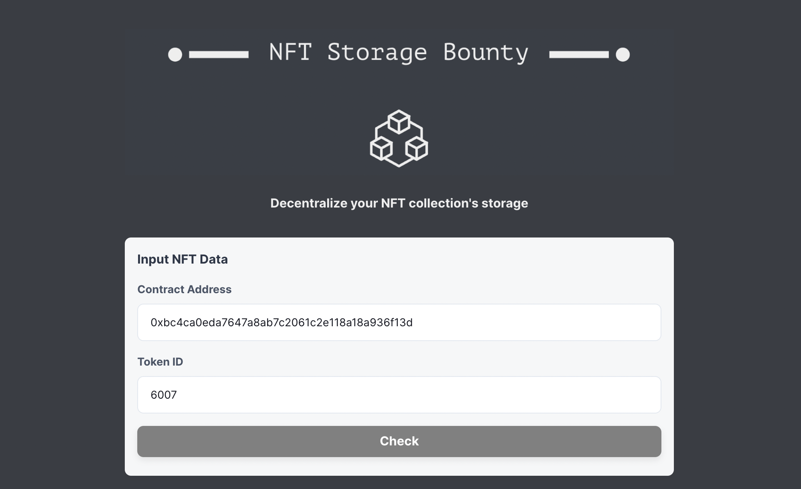
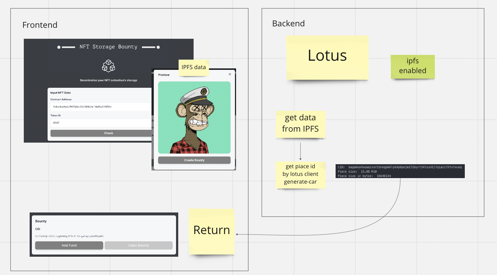

# NFT Storage Bounty

## Submission

### Live Demo

### Tryout App

## Describe Project

This is a bounty creation app for NFT content. Users can input the NFT info, then the system automatically converts IPFS data into Filecoin format, which enables users to create Filecoin deal bounty on NFT content directly.

### Benefit

We can decentralize the NFT collection's storage with incentives.

## How It Works

### Technical Detail

#### Sample Image

https://bafybeiblm23hq22c3k6fqlvvpbiototds4kblkf5yas5iti6e2igtnbdva.ipfs.nftstorage.link/

#### Calculated Piece ID

CID: baga6ea4seaqcxsr53negpkklyb4p6pojm2726yrr34lszn5j7qiacc7htv7vueq
Piece size: 15.88 MiB
Piece size in bytes: 16646144

#### Deployed Contracts on Hyperspace

DealRewarder: 0xec8845201c40Ec2C258b96CAD110aD01566247F6

#### Tested deal

bafyreig5obeibqjphohqyaa3t5blgclvsathhdmny7iot6mksigxsuzyam

## Reference

### Main Guide

We are using the following document as the main reference.

https://medium.com/@rvk_rishikesh/build-your-first-datadao-on-fvm-6ed38b940103

And we forked the following contract as quick start

https://github.com/filecoin-project/fevm-hardhat-kit/tree/main

### Previous Project

Community Storage is extended from NFT Storage Bounty, which is my winning project in Hack FEVM.
It re-uses the frontend component, but smart contracts and business logic are newly implemented.

## Disclaimer

This service requires running IPFS and Lotus, and it was hard to deploy, so only the front end is deployed.

To make the demo possible, I hard-coded the piece id and size calculation process.
